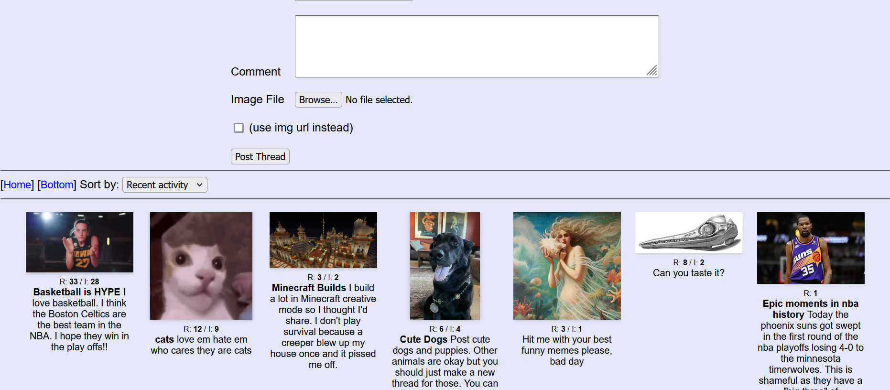

# Aaron-Image-Board
 An image board made with MEEN (ejs)

# Plan for admin feature:

1. SECRET login page where admin can log into an admin session

2. Admins can view any user's user page

3. Contemplate creating secret user pages based on IP, so no real anonymity. Aids in moderation.
NOTE: IP can be changed, so not a perfect solution

4. Admin Page: lists every post and thread on the site, searchable, with CRUD for banning, deleting

5. Add CRUD to admin session: while browsing, admins can delete, ban, snip posts

# Plan for posting

1. Add a reply button to posts that conjures up a popup/floating New Post form. Form's textarea is auto-populated with the reply tag (>>##)

2. Continue to improve file upload process

3. Add captcha to sift for humans

# Plan for automatic thread pruning

1. Should threads be deleted after a long enough inactivity?

2. I don't think so unless user base is large enough that discussion becomes unmanageable. 